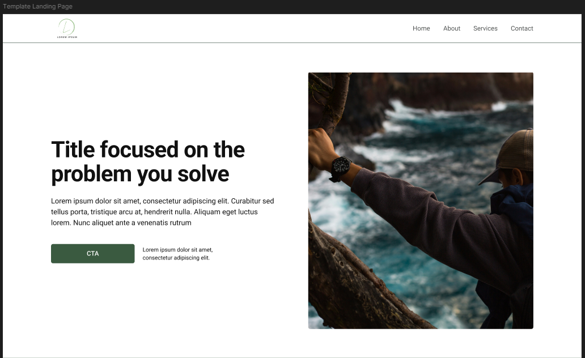
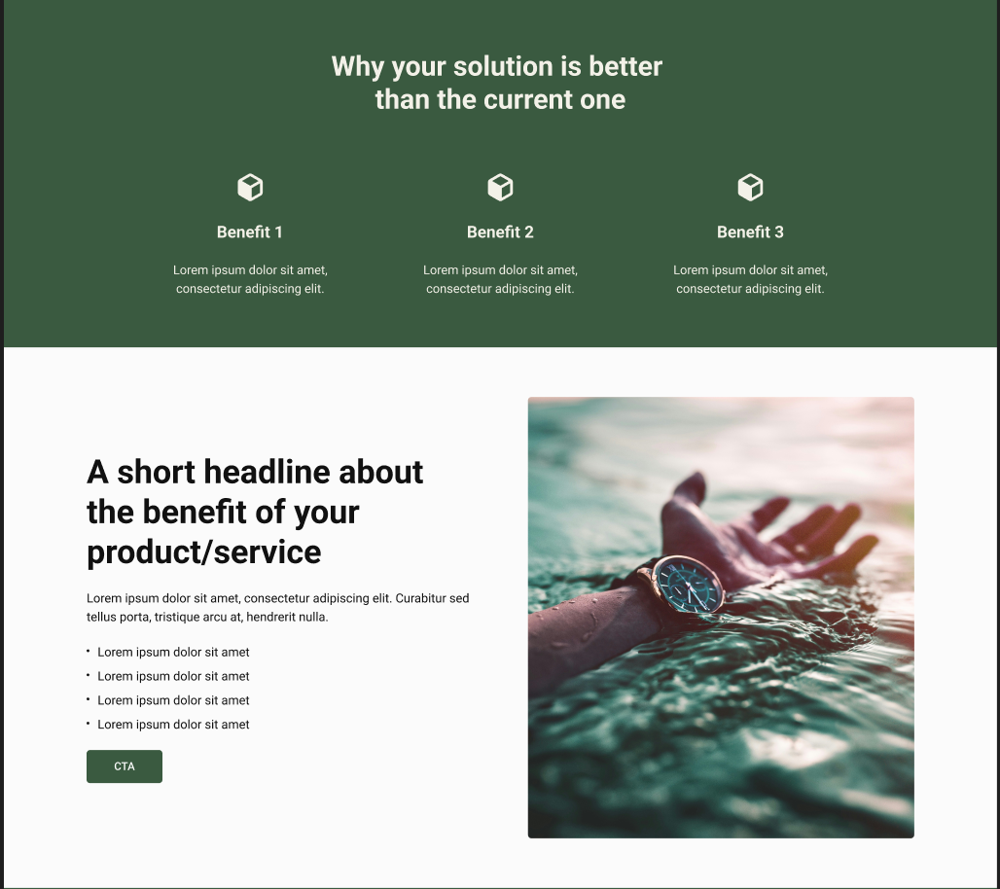
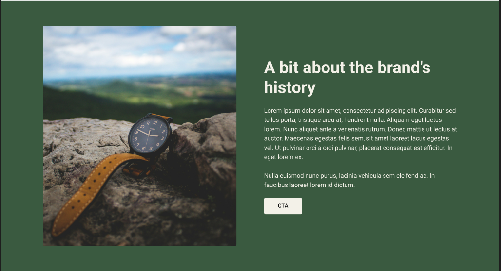
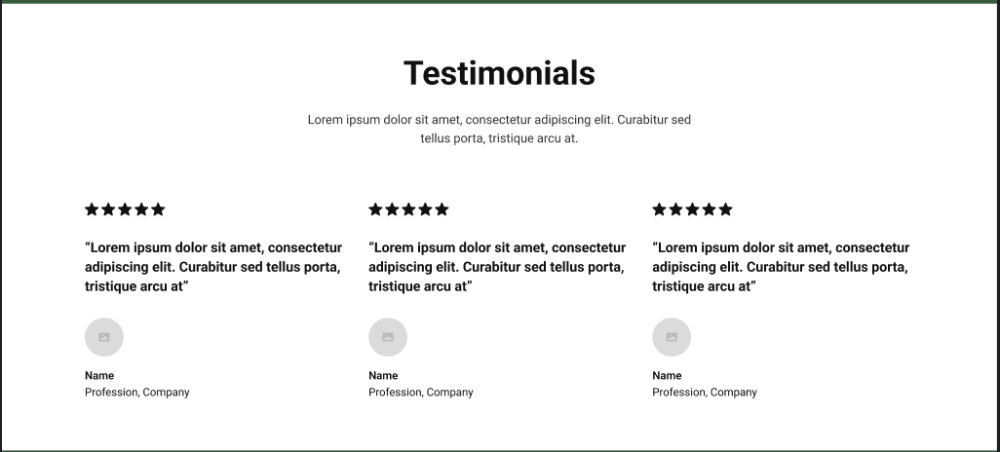
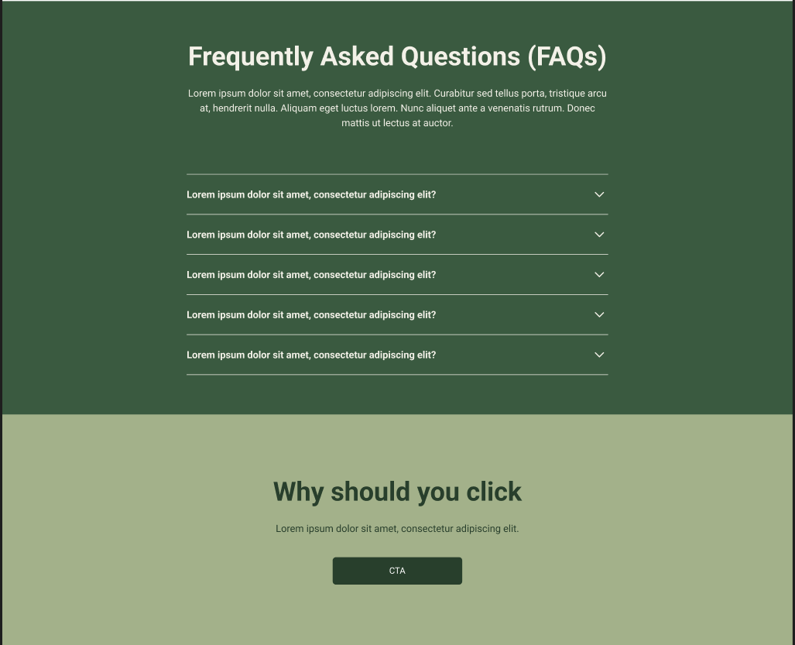
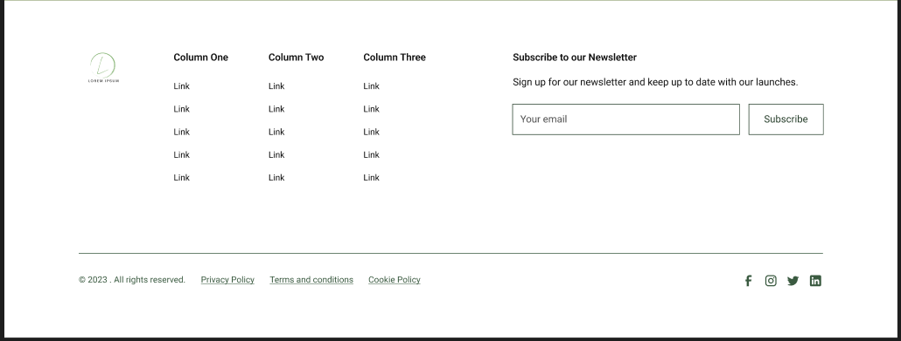
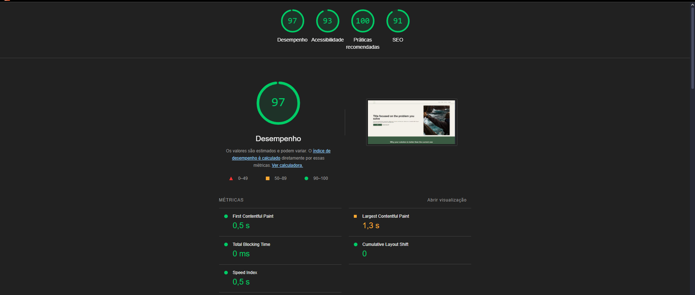

<h1 align="left">Project Landpage Template</h1>

###

This project is intended to be an initial part of my portfolio. With this project, I'm aiming to improve my basic skills by creating a template that makes it possible to create several landpages with simple changes to images and variables.

###

<h2 align="left">Figma</h2>

###

For this template, I searched the Figma community for a low-fidelity wireframe to use as a base and modified it for the final result of a landpage.

###

<h2 align="left">Lighthouse</h2>

###

###

<h2 align="left">I code with</h2>

###

  
  
  
  
  
  
  

###